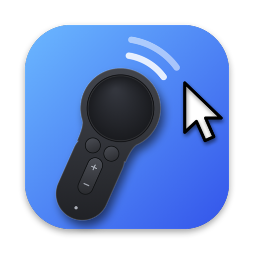

<p align="center">
  
</p>

# GearVR Air Mouse 4 macOS

Turn a Samsung Gear VR controller into a wireless mouse for macOS.

**GearVRMouse** is a small menu-bar app. It connects to the controller over Bluetooth LE and turns the touchpad, buttons and motion sensors into cursor movement, clicks, drags and scrolling. Point the controller like an air mouse, swipe the touchpad like a trackpad, or mix both. Seven control modes cover different ways of holding and using it. It's a single Swift file with no third-party dependencies.

A sibling project, [OculusGo Air Mouse 4 macOS](https://github.com/volkanger/OculusGo-Air-Mouse-4-macOS), does the same for the Oculus Go controller, with the same control modes.

## Requirements

- A Samsung Gear VR Controller (e.g. model ET-YO324)
- A Mac with Bluetooth, macOS 12 or later
- Xcode or the Xcode Command Line Tools (`xcode-select --install`), for `swiftc`

## Build

```bash
git clone https://github.com/volkanger/GearVR-Air-Mouse-4-macOS.git
cd GearVR-Air-Mouse-4-macOS
./build.sh
```

This produces `build/GearVRMouse.app`.

`build.sh` signs the app with the first **Apple Development** certificate in your keychain, if you have one. A stable signature means macOS keeps the Accessibility permission when you rebuild. Without a certificate it falls back to ad-hoc signing, which works, but you'll need to grant Accessibility again after every rebuild. To choose a specific identity:

```bash
SIGN_ID="Apple Development: Your Name (TEAMID)" ./build.sh
```

## First run

1. **Start the app.**
   ```bash
   open build/GearVRMouse.app
   ```
   A controller icon appears in the menu bar. The app has no Dock icon.
2. **Allow Bluetooth** when macOS asks.
3. **Allow Accessibility.** macOS will point you to **System Settings › Privacy & Security › Accessibility**. Turn on **GearVRMouse**, then quit and reopen the app. This permission is what lets the app move the cursor and click.
4. **Wake the controller** with a short press of **Home**. The app finds and connects to it automatically. You don't need to pair it in System Settings first, and macOS usually doesn't list it there anyway.
5. If macOS shows **"Connection Request from: Gear VR Controller"**, click **Connect**.
6. **Keep the controller still for about 2 seconds** after it first connects, while the gyro calibrates.

To start the app at login, add `GearVRMouse.app` under **System Settings › General › Login Items**.

## Control modes

Choose a mode from **Control Mode** in the menu. With the menu open, ⌘1 to ⌘7 select a mode, and hovering over a mode shows its button map. In every mode, **Volume + / −** scroll up and down, and repeat while held.

| Mode | Gyro points | Touchpad swipe | Touchpad tap | Pad click | Trigger | Back | Home |
|---|---|---|---|---|---|---|---|
| **1 · Hold Trigger to Point, Pad Mouse** *(default)* | While trigger held | Moves cursor; scrolls while pointing (up/down reversed); ignored while the pad is pressed | Left click | Tap: left click · Hold + tilt: scroll | Tap: left click · Hold: point | Browser back | Right click |
| **2 · Home Toggles Gyro** | When toggled on; touching the pad pauses it | Moves cursor | Left click | Left click (hold = drag) | Tap: left click · Hold: grab-scroll | Right click | Gyro on/off |
| **3 · Hold Trigger to Point** | While trigger held | Scrolls | — | Left click (hold = drag) | Tap: left click · Hold: point | Browser back | Right click |
| **4 · Touch Pad to Point** | While a finger is on the pad | — | — | Tap: left click · Hold: grab-scroll | Left click (hold = drag) | Browser back | Right click |
| **5 · Back Toggles Gyro** | When toggled on | Moves cursor; scrolls when gyro on | Left click | Left click (hold = drag) | Left click (hold = drag) | Tap: gyro on/off · Hold: tilt to scroll | Right click |
| **6 · Touchpad Only** | Never | Moves cursor | Left click | Left click (hold = drag) | Right click (hold = drag) | Scroll up | Scroll down |
| **7 · Hold Trigger to Point, Press Pad to Scroll** | While trigger held | Scrolls (ignored while the pad is pressed) | — | Hold + move the controller: grab-scroll | Tap: left click · Hold: point | Browser back | Right click |

What the terms mean:

- **Point:** move the cursor by aiming the controller. Turn it left/right for horizontal movement and tilt it up/down for vertical. It uses gravity from the accelerometer, so it works however you hold the controller. While pointing, motion waves appear next to the controller icon in the menu bar.
- **Hold:** a press counts as a hold after the **Hold Delay** (default 150 ms). Releasing sooner counts as a tap. The cursor stays still during the delay, so squeezing the trigger won't nudge it. **Back** in mode 5 uses its own 250 ms delay.
- **Grab-scroll:** the content follows your motion, like dragging the page.
- **Tilt to scroll:** works like a joystick. Tilt up to scroll toward the top; in mode 5, turn left or right to scroll sideways.
- **Mode 1, trigger + pad click together:** click-and-drag while pointing with the gyro. Releasing either one drops. Nothing else fires until both are released.
- **Mode 6, Back / Home:** they scroll like Volume + / −: one step per press, then repeating while held.
- **Browser back:**
  - **Chrome, Brave, Firefox, Edge, Arc, Vivaldi and Opera** get the mouse "back" button.
  - **Safari and other apps** get ⌘←. If a text field has focus, ⌘← moves the text cursor instead of going back.
  - To choose one method everywhere, set `backMethod` (see [Tuning](#tuning)).

If the cursor drifts on its own while pointing, lay the controller flat and choose **Recalibrate Gyro** from the menu.

## Menu

| Item | What it does |
|---|---|
| Status line | Connection state |
| Control Mode | Pick one of the seven modes (⌘1–⌘7 while the menu is open) |
| Hold Delay | 100–300 ms before a trigger or pad press counts as a hold |
| Gyro Speed | 0.5×–4× pointing speed |
| Recalibrate Gyro (⌘R) | Re-measure gyro drift. Keep the controller still |
| Reconnect | Drop and re-establish the Bluetooth connection |
| Quit (⌘Q) | Quit the app |

## Tuning

Most settings are in the menu. The rest can be changed from Terminal:

```bash
defaults write local.gearvrmouse touchSpeed -float 3.0
```

Then choose **Reconnect** in the menu. To restore a default, use `defaults delete local.gearvrmouse <key>`.

| Key | Default | Effect |
|---|---|---|
| `touchSpeed` | 2.5 | Touchpad cursor speed |
| `touchAccel` | 0.12 | Touchpad acceleration: faster swipes go further |
| `touchFilter` | 0.7 | 0–1. Lower values are smoother but less responsive |
| `maxPacing` | 0.035 | Seconds over which each Bluetooth burst is smoothed |
| `tapToClick` | true | Tap the touchpad to click, in modes that support it (`-bool false` to disable) |
| `scrollLines` | 3 | Lines per Volume button press (and Back/Home in mode 6) |
| `gyroSpeedX` / `gyroSpeedY` | 0.012 | Base gyro speed per axis (the menu's Gyro Speed multiplies this) |
| `gyroAccel` | 0.0007 | Gyro acceleration: faster turns go further |
| `gyroDeadzone` | 60 | Ignore tiny motions (reduces jitter and drift) |
| `gyroSignX` / `gyroSignY` | -1 | Set to `1` to invert a pointing axis |
| `forwardAxis` | 1 | Sensor axis along the controller (0, 1 or 2). Change it if up/down and left/right are swapped |
| `scrollSign` | 1 | Set to `-1` to reverse swipe and grab scrolling |
| `touchScrollSpeed` | 4 | Scroll distance per touchpad movement |
| `grabScrollSpeed` | 1.5 | Scroll distance per cursor movement while grab-scrolling |
| `gyroScrollSpeed` | 1.5 | Tilt-to-scroll speed |
| `gyroScrollSign` | 1 | Set to `-1` to reverse tilt-to-scroll |
| `backHoldDelay` | 0.25 | Mode 5: seconds before a held Back starts scrolling |
| `backMethod` | `auto` | Browser back: `auto`, `mouse4` or `cmdLeft` (a string: `defaults write local.gearvrmouse backMethod mouse4`) |

## Troubleshooting

- **It never connects.**
  - Press **Home** to wake the controller.
  - Check the menu status line.
  - Make sure Bluetooth is allowed under **Privacy & Security › Bluetooth**.
- **The status says "Stale pairing".** The Mac and the controller have mismatched pairing data.
  1. In **System Settings › Bluetooth**, find **Gear VR Controller**, click ⓘ and choose **Forget This Device**.
  2. Hold **Home** on the controller until its light cycles colors.
  3. Wait for the app to reconnect, and click **Connect** if macOS asks.
- **The controller connects but the cursor doesn't move.** Accessibility isn't granted, or it no longer matches the app. In **Privacy & Security › Accessibility**:
  1. Remove GearVRMouse with **−**.
  2. Reopen the app, turn it back on, then quit and reopen the app again.
- **The app won't open after a macOS or Xcode update.** Rebuild with `./build.sh`. It pins the minimum macOS version, so a newer toolchain doesn't produce an app your Mac can't run.
- **The cursor freezes for under a second about every 20 seconds.** This is a known issue, described below.
- **Pointing moves the wrong way.**
  - Flip the axis with `gyroSignX` / `gyroSignY`.
  - If up/down and left/right are swapped, try `forwardAxis` (0, 1 or 2).

## Known issues

- **Periodic disconnects.** On macOS the controller drops the Bluetooth link about every 19.5 seconds. It happens whether or not any commands are sent, with or without keep-alives, and even when paired. The app reconnects immediately, so the cursor pauses for roughly 0.6–0.8 s. The likely cause is that the controller asks for faster Bluetooth link timing than macOS will grant. Android apps can request that timing; Mac apps can't. This hasn't been confirmed.
- **Security note.** The app connects to any nearby device that advertises as "Gear VR Controller". A malicious device in Bluetooth range could pretend to be one and send mouse input. Quit the app when you're not using it if that matters in your environment.

## How it works

- **Connection:** CoreBluetooth finds the controller and subscribes to its data. Mouse input is posted with Quartz `CGEvent`, which is why Accessibility permission is required.
- **Protocol:**
  - Service `4f63756c-7573-2054-6872-65656d6f7465`.
  - Data characteristic `c8c51726-81bc-483b-a052-f7a14ea3d281` sends 60-byte notifications at about 70 Hz.
  - Command characteristic `c8c51726-81bc-483b-a052-f7a14ea3d282` takes 2-byte commands.
- **Startup:** the app sends **low-power mode off (`07 00`) before sensor mode (`01 00`)**. Without that, the controller falls back to ~100 ms Bluetooth bursts and loses more than half its packets. Sending it *after* sensor mode stops the stream, and so does VR mode (`08 00`) on macOS.
- **Packet layout:**
  - Byte 58 holds the buttons: trigger `0x01`, home `0x02`, back `0x04`, touchpad click `0x08`, vol+ `0x10`, vol− `0x20`.
  - Bytes 54–56 hold touch X/Y (0–315).
  - Bytes 4–51 hold accelerometer and gyro samples.
  - Bytes 0–3 hold a device timestamp (~14325 units per packet). The app uses it to detect dropped packets.
- **Smoothing:** motion from each Bluetooth burst is spread over a 120 Hz output timer. Gyro pointing uses gravity from the accelerometer, so it works however you hold the controller.

### Debug flags

These run the app from Terminal with diagnostics printed to the console:

```bash
build/GearVRMouse.app/Contents/MacOS/GearVRMouse --dump --stats
```

- `--dump`: print decoded packets and raw button bytes. Mouse output is disabled.
- `--stats`: log packet rate, gaps and dropped packets every 3 s.
- `--gatt`: list every service and characteristic and read their values.

## Credits

- Inspired by [Dream Mouse](https://github.com/kaminoer/Dream-Mouse). Seeing it turn a Gear VR controller into an air mouse on Android showed this old controller could get a second life.
- Protocol details (UUIDs, command codes, packet layout) from [jsyang's Gear VR controller reverse engineering](https://jsyang.ca/hacks/gear-vr-rev-eng/) ([gearvr-controller-webbluetooth](https://github.com/jsyang/gearvr-controller-webbluetooth)) and [uutzinger/gearVRC](https://github.com/uutzinger/gearVRC).

## License

[MIT](LICENSE). Not affiliated with or endorsed by Samsung, Meta or Oculus. Gear VR is a trademark of its respective owner.
